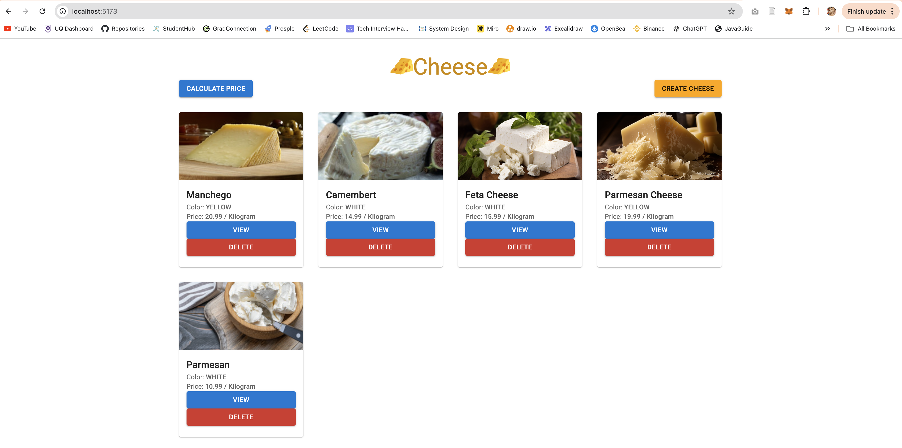
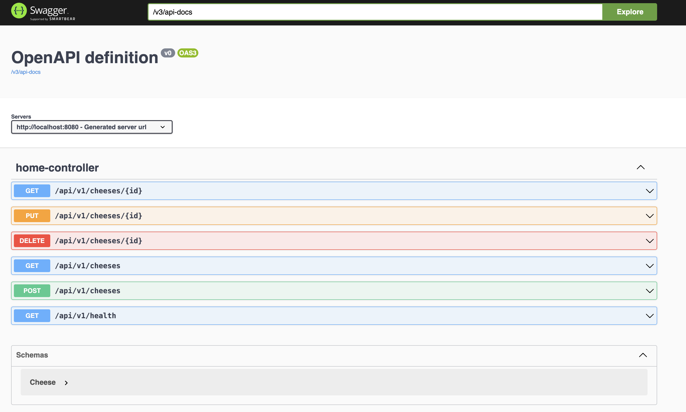
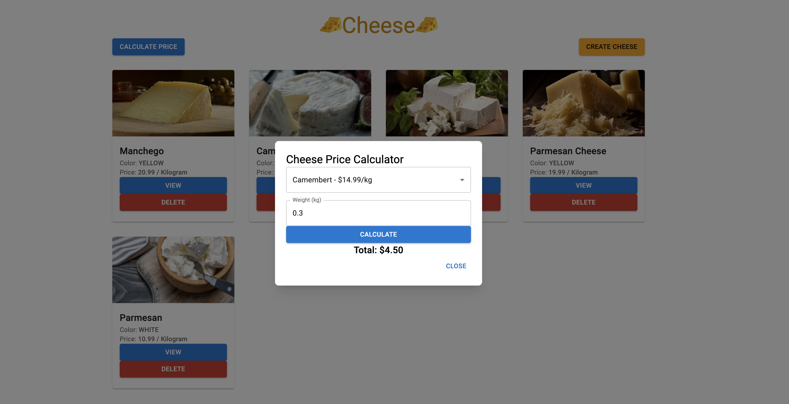
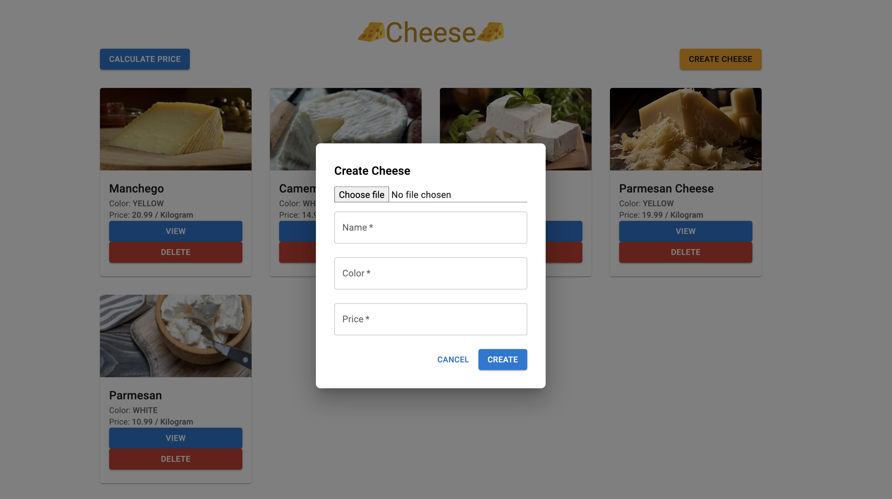
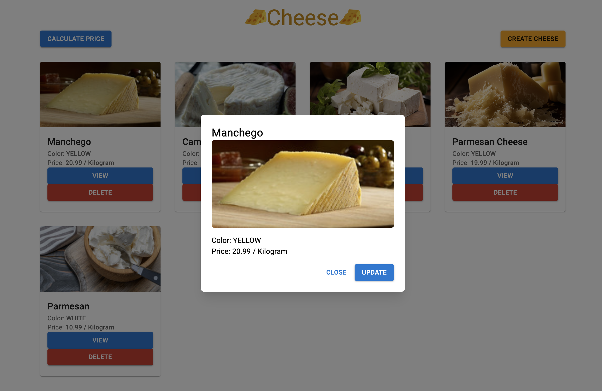
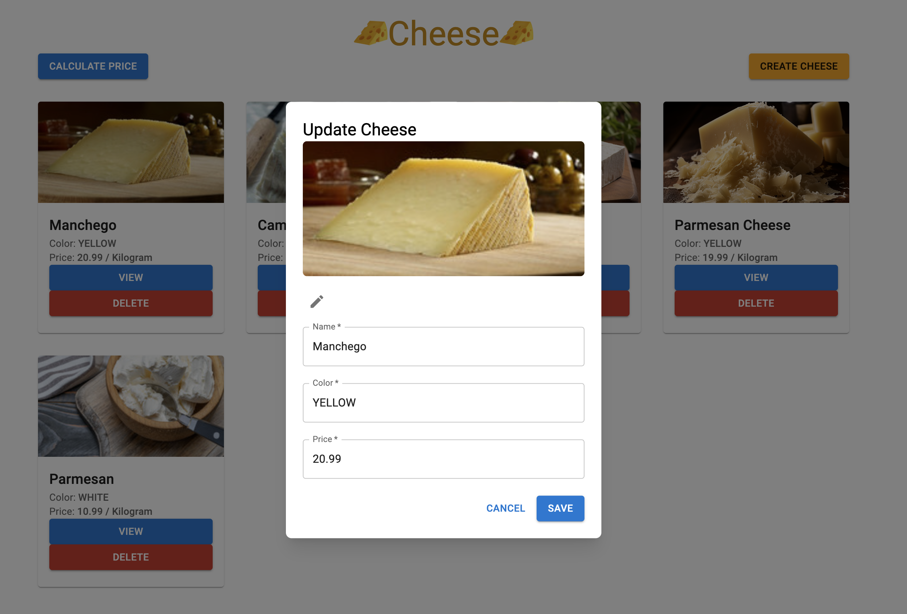
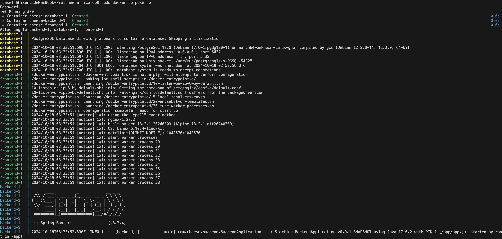

<div align="center">
  <h1>
    The PZ Cheeseria🧀
  </h1>
  
</div>


## About the Project

The PZ Cheeseria is a small POC of the front-end and an API showing CRUD capabilities that displays 5
different cheeses with pictures, price per kilo and the cheese colour, along with a calculator that allows our customers to select a particular type of cheese and show them the total price based on the weight they're interested in.


### Tech Stack

<details>
  <summary>Frontend</summary>
  <ul style="font-size:14px">
    <li>React</li>
    <li>Axios</li>
    <li>Material UI</li>
    <li>Tailwind CSS</li>
  </ul>
</details>

<details>
  <summary>Backend</summary>
  <ul style="font-size:14px">
    <li>Java Spring Boot</li>
    <li>JPA</li>
    <li>Swagger</li>
    <li>Junit Test</li>
  </ul>
</details>

<details>
  <summary>Database</summary>
  <ul style="font-size:14px">
    <li>Postgres</li>
  </ul>
</details>

<details>
  <summary>DevOps</summary>
  <ul style="font-size:14px">
    <li>Docker</li>
    <li>Docker-compose</li>
  </ul>
</details>


### Folder Structure

```txt
- backend
	- ...
	- src
		- main/java/com/cheese/backend
			- config // configuration setting (e.g. swagger configuration)
			- controller // controll level to receieve request
			- service // deal with business
			- entity // for database
			- repository // query
			- enums // Cheese Color
		- test/java/com/cheese/backend/HomeControlloerTest
			- HomeControllerTest.java // Unit Test for all endpoints
	- Dockerfile // build backend image
	- ...
- frontend
	- ...
	- src
		- api // using Axios to handle APIs
		- components // reuseable components
		- pages // page
	- Dockerfile // build frontend image
	- nginx.conf // Nginx configuration
- initdb // pre-saved db data for 5 cheeses display
- ...
```


## Getting Start

### Local Deployment

Before starting the deployment, ensure that [Docker](https://www.docker.com/) is installed on your system.

To start your local deployment, run the following line:

```bash
docker compose up --build
```

Now, you can access the PZ Chesseria via [http://localhost:5173/](), and explore API endpoints via [http://localhost:8080/swagger-ui/index.html]().


To stop your local deployment, simply run the following line:

```bash
docker compose down
```


### Test

You can also run the whole unit tests at `test/java/com/cheese/backend/HomeControlloerTest/HomeControllerTest.java`


## Comments

Because of the time limit, I will stop my implementation here. However, this project already has enough features to satisfy all the requirements. There are still many things I could focus on if I had more time:

1. **Image upload & storage**: AWS S3 or EFS would be nice choices here because of their high reliability and cost-efficiency (S3 would be cheaper than EFS, tho).
2. **Separate Image table**: In my table design, image data is stored inside the cheese table. Using a separate table for images and joining them together would be better.
3. **Swagger documentation**: I have my documentation at `HomeController.java`, but it's a good practice to place them at the swagger-ui, sry no time to finish that :/
4. **UI design**: The animations and UI layout can be improved if I have more time to design.
5. **Backend error handling**: I could add more if statements in the `homecontroller` to better deal with different errors.
6. **Unit tests**: I have only developed the majority of the tests; these can be improved if I have more time.
7. **CI/CD**: A CI/CD pipeline can be applied. When a specific action is triggered (e.g., a GitHub push), it will automatically run tests and deploy updates (using GitHub Actions or Jenkins).


## Screenshot

**Swagger UI**




**Home page**


**Calculator**




**Create a new cheese**




**Detail page**




**Update page**




Docker deployment




## License

[MIT License](LICENSE)
